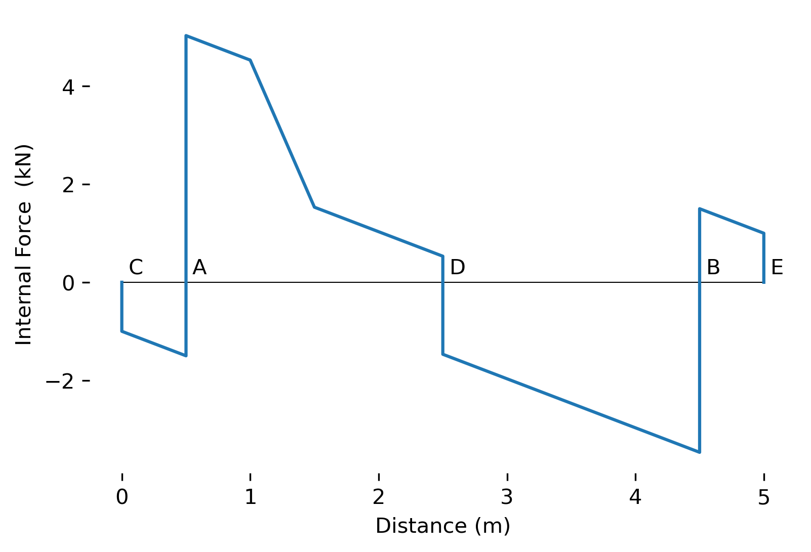
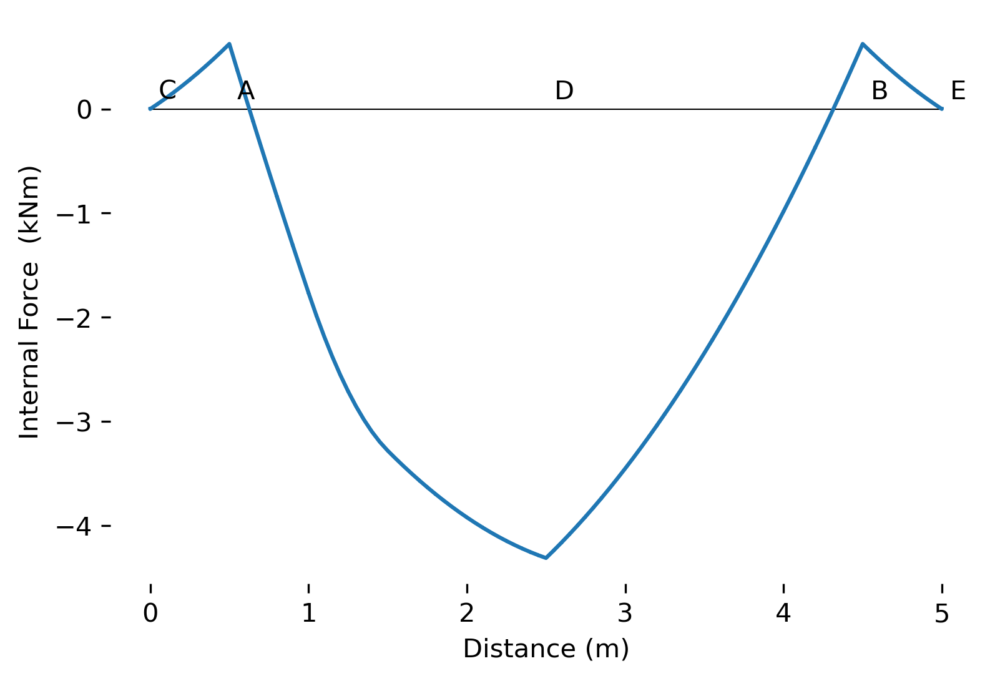
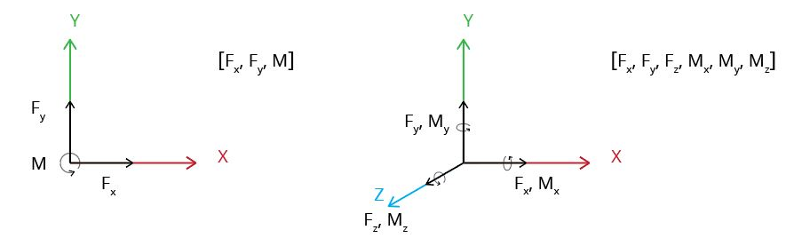

# PlaneSections
<p align="center">
  
</p>

A lightweight finite element beam bending library built on libraries like [PyNite](https://github.com/JWock82/PyNite) and [OpenSeesPy](https://github.com/zhuminjie/OpenSeesPy).
The goal of PlaneSections is to make easy-to-use beam anayses, which can be used to quickly document structural calculations.
**Note, results are only stored at nodes specified by the user - all intermediate values in plots are linearly interpolated**


**NOTE:**
Units for force and length must be applied to the beam in a [consistent unit base for FEM](https://femci.gsfc.nasa.gov/units/index.html).
PlaneSections has been design with Metric units in mind in terms of scaling diagrams. For those using imperial units, results will work with a consitent unit basis, but the scale of the digrams may be off.

## Contents
* [Installation](https://github.com/cslotboom/planesections#Installation)
* [Features](https://github.com/cslotboom/planesections#Features)
* [Documentation](https://github.com/cslotboom/planesections#Documentation)
* [Demo](https://github.com/cslotboom/planesections#Demo)
* [Coordinates](https://github.com/cslotboom/planesections#Coordinates)
* [Solvers](https://github.com/cslotboom/planesections#Solver)
* [Work Status](https://github.com/cslotboom/planesections#Status)


## Installation
The default package is installable through pip.
```
pip -m install planesections

```
The package with the optional OpenSeesPy dependancy is installable with 
```
pip -m install planesections[opensees]

```

## Features:
2D and 3D beams can be anayzed under the following force types:
- Point loads
- Point Moments
- Line Element loads
- Linearly varying element loads (2D only).

Diagrams can also be made of 2D beams, but the support types that can be plotted are limited.

## Documentation
All major functions and classes are documented on read-the-docs: https://planesections.readthedocs.io/en/latest/

## Demo
The PlaneSections can plot beam representations that can be used in documentation.
It's also possible to get the output bening moment, shear force, rotation, and deflection diagrams.

``` Python

import planesections as ps

# Define node locations, and support conditions
L = 5
beam = ps.newEulerBeam(L)

# Define beam and fixities
pinned = [1,1,0]
beam.setFixity(L*0.1, pinned, label = '1')
beam.setFixity(L*0.9, pinned)

# Define loads
Pz = -1
beam.addVerticalLoad(0, Pz, label = 'A')
beam.addVerticalLoad(L*0.5, 2*Pz, label = 'B')
beam.addVerticalLoad(L, Pz, label = 'C')
beam.addDistLoadVertical(0, L, Pz)
beam.addDistLoadVertical(1, L*0.3, 5*Pz)

# Plot the beam diagram
ps.plotBeamDiagram(beam)

# Run the analysis
analysis = ps.PyNiteAnalyzer2D(beam)
analysis.runAnalysis()

# Plot the SFD and BMD
ps.plotShear(beam)
ps.plotMoment(beam)
```

<p align="center">
  
</p>
<p align="center">
  
</p>  
<p align="center">
  
</p>  

## Coordinates
The coordinant system used for beams is as follows:
<p align="center">
  
</p>


## Further Examples
See the examples folder for more examples!

## Solvers
The opensees solver is included as an optional dependancy. It is significantly faster than the PyNite solver (~100x), but the license is more limited in use. OpenSees allows commercial use of the package, but does not allow resale without permission, so use at your own risk! [OpenSees License.]([https://femci.gsfc.nasa.gov/units/index.html](https://opensees.github.io/OpenSeesDocumentation/developer/license.html)

Some restrictions exist for OpenSees license, so this library has been added as an optional dependancy


## Status
The next development steps are to:
- [] Add labels to diagrams.

PlaneSections is almost "feature complete" in terms of it's analysis functionality. The only additional analysis features I might include are:
- Spring supports
- Internal hinges
- Better cross section support
These are not slated to be in the next release.


